# Tutorial de OpenSCAD

## Introducción

OpenSCAD es un programa CAD (Computer Aided Design o Diseño asistido por ordenador) en 3D. La característica principal es que OpenSCAD *no se maneja usando el ratón* sino por medio de un lenguaje. Esto que a primera vista parece mucho más incómodo se vuelve en realidad mucho más potente cuando queremos construir estructuras repetitivas.

El apartado interesante de los programas de este tipo es la capacidad de **imprimir las piezas** usando una impresora en 3D. Aunque no se disponga de una, hay muchos servicios en Internet que las imprimen y envían a domicilio a precios cada día menores.

OpenSCAD tiene versiones para los principales sistemas operativos: Windows, Mac y Linux y no necesita instalación: puede descargarse un ZIP, descomprimirlo y simplemente ejecutar el programa

## Primeros pasos

Al ejecutar el programa veremos algo como esto:

{ width=100% }

Aunque nosotros crearemos un proyecto nuevo vacío pulsando el botón "Nuevo", OpenSCAD ofrece algunos ejemplos creados y que nos permiten ver algunas de las capacidades. Despues de crear un nuevo proyecto, veremos algo como esto:

{ width=100% }

### Descripción del interfaz

* En la parte izquierda podremos escribir la descripción de nuestros modelos.
* En la parte central, arriba, podremos ver unos ejes de coordenadas:

    * Observa el eje de las X, está en rojo y apunta hacia la derecha: esto significa que en principio, los valores positivos de X crecen en ese sentido.
    * El eje de las Y apunta "hacia el interior de la pantalla", en diagonal.
    * El eje de las Z apunta hacia arriba.
* En la parte central, abajo, veremos un panel llamado "Consola", nos permitirá ver el proceso que sigue OpenSCAD al construir nuestros modelos, incluyendo los errores que cometamos.
* En la parte central, derecha, veremos los errores que cometamos y el punto exacto donde los hemos cometido.
* En la parte derecha, veremos un panel llamado "Customizer" que nos permitirá modificar algunas opciones, en este tutorial *no lo usaremos*

## Previsualización y renderizado

OpenSCAD permite dos operaciones que aparentemente son iguales: previsualizar y renderizar.

* Previsualizar requiere pulsar F5 y nos permitirá ver los colores de las piezas (veremos los colores más adelante). Usa un algoritmo con aproximaciones, lo que lo hace más rápido pero también maś impreciso.

* Renderizar requiere pulsar F6. No muestra los colores de las piezas pero usa un algoritmo sin aproximaciones, por lo que el resultado que veremos será el que se obtenga al imprimir una pieza.

## Exportación a STL

Si en cualquier momento deseamos imprimir una pieza o enviarla a alguno de los servicios de impresión mencionados, casi con toda probabilidad necesitaremos exportar nuestro diseño al formato STL (viene de STereoLitography, un formato casi universal para la impresión de piezas).

Esta opción está en el menú File, dentro de Export. Si usamos el programa en español será en Archivo, en la opción Exportar.

### Un primer modelo

Escribe en la parte izquierda el siguiente código:

    cube ([12, 3, 4])

Pulsa despues F6 y verás algo como esto:

{ width=100% }

Si dejas pulsado el botón principal del ratón y "arrastras" el escenario, podrás cambiar el punto de vista. Si usas la rueda del ratón podrás cambiar la escala del modelo. Usa ambas posibilidades para explorar el modelo desde todos los puntos de vista.

## Elementos básicos del lenguaje

Todo el lenguaje se basa en estas estructuras, presta especial atención a los puntos y comas:

    //Construye un objeto
    objeto();

    //Asigna un valor a una variable
    variable=valor;

    //Un operador modifica algo, una acción realiza una tarea
    operador() accion();

    //Se pueden encadenar operadores
    operador() operador() accion();

    //Si queremos aplicar un operador
    //a varias acciones a la vez
    operador() { accion(); accion(); }

## Valores y vectores

En una variable podemos almacenar números y textos. Si necesitamos trabajar con varios valores a la vez, se usan vectores, que van entre corchetes:

    altura=10.2;
    nombre="Modelo A1";
    coordenadas=[12, 3, 4];

Es frecuente usar los vectores con coordenadas. De hecho, nuestro modelo inicial usaba las coordenadas ``x=12``, ``y=3``, ``z=4``.

## Objetos 3D: cubo

Podemos crear cubos de dos maneras:

    //Esto pone un cubo poniendo una esquina
    //en la coordenada [x=0, y=0, z=0] y la 
    //esquina opuesta en [12, 3, 4]
    cube( [12, 3, 4] );

    //Esto pone el "centro del cubo" 
    //en la coordenada [x=0, y=0, z=0] y 
    //hace que el cubo mida 12 en el eje X,
    //3 en la y y 4 en la z
    cube( [12, 3, 4], center=true);

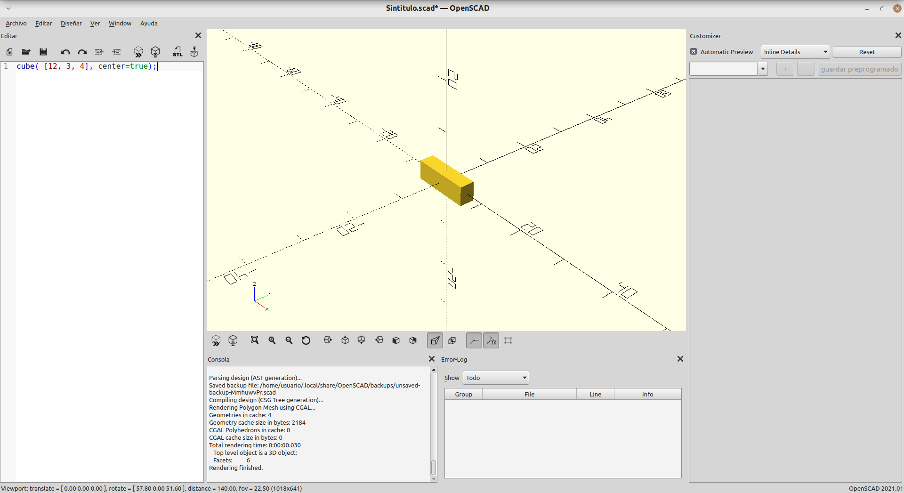{ width=100% }

Si combinamos este proceso con variables, podemos hacer cosas como esta:

    ancho_x=12;
    alto_z=4;
    profundo_y=3;
    cube( [ancho_x, profundo_y, alto_z], center=true);

Esto produce **exactamente el mismo resultado** pero esta forma de trabajar nos resultará útil más adelante.

## Operadores: traslación

Es posible hacer que un objeto se traslado a otro punto del espacio usando ``translate([x, y, z])``. Por ejemplo, hagamos esto:

    //Esta parte es igual que la anterior
    ancho_x=12;
    alto_z=4;
    profundo_y=3;
    cube( [ancho_x, profundo_y, alto_z], center=true);

    arista_cubo=3;
    //Observa que esto es una sola línea
    translate([0, 0, profundo_y]) 
        cube ([arista_cubo,arista_cubo,arista_cubo], center=true);

    //Y esto es también una sola línea
    translate([0, 0, profundo_y+arista_cubo]) 
        cube ([ancho_x, profundo_y, alto_z], center=true);

Deberías ver algo como esto:

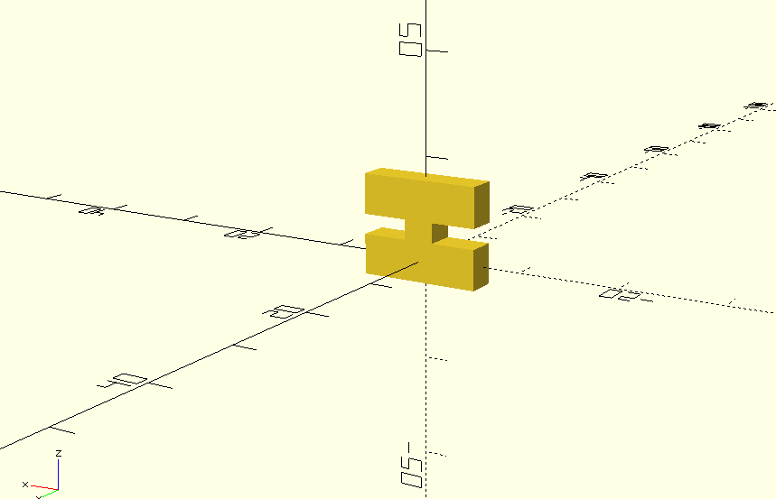{ width=100% }

Observa ahora el potencial de usar las variables. Vamos a modificar ``ancho_x`` y lo ponemos a 20 (omitimos los comentarios por brevedad):

    ancho_x=20;
    alto_z=4;
    profundo_y=3;
    cube( [ancho_x, profundo_y, alto_z], center=true);

    arista_cubo=3;
    translate([0, 0, profundo_y]) 
        cube ([arista_cubo,arista_cubo,arista_cubo], center=true);

    translate([0, 0, profundo_y+arista_cubo]) 
        cube ([ancho_x, profundo_y, alto_z], center=true);

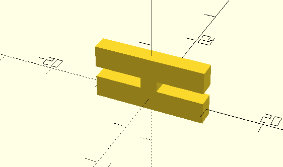{ width=100% }

Sin embargo, esto no implica que la pieza esté bien parametrizada. Prueba a cambiar el alto o la profundidad y verás que hay que recalcular. Se deja como ejercicio.

## Objetos 3D: esfera

Se usa así:

    //Crea una esfera de radio 3
    sphere(r=3)

Si queremos crear una esfera en otro punto del espacio, podemos usar ``translate``. Así, por ejemplo, esto crea dos esferas, una en el centro y la otra un poco más a la derecha:

    sphere(r=2);
    translate([4, 0, 0]) sphere(r=2);

El resultado de este código es esto:

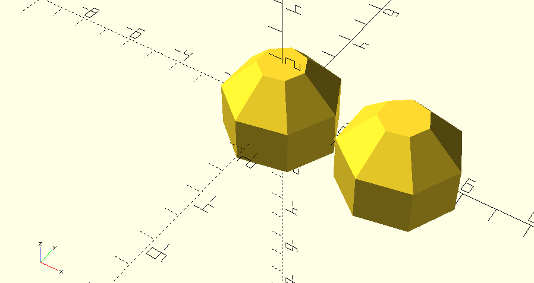{ width=100% }

Un detalle es que por defecto, las esferas tienen una resolución muy baja y de hecho prácticamente parecen poliedros. Si queremos aumentar la cantidad de "caras" que tienen las esferas podemos usar un parámetro extra llamado ``$fn`` que regula esto:

    //Esferas con alta resolución
    sphere(r=2, $fn=40);
    translate([4, 0, 0]) sphere(r=2, $fn=40);

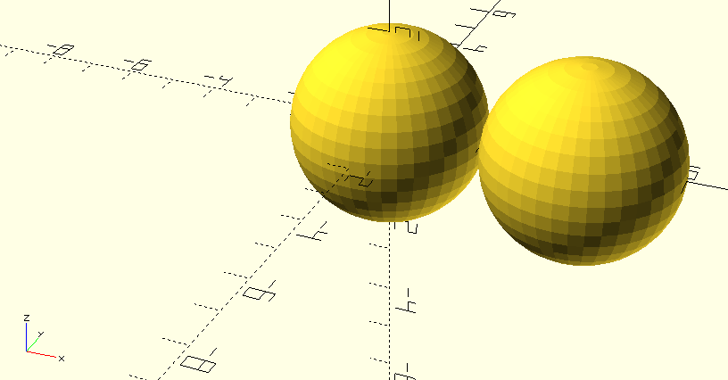{ width=100% }

El parámetro $fn indica la cantidad de fragmentos por arco. El programa recomienda mantenerse por debajo de 50 y no poner nunca valores mayores de 128.

## Objetos 3D: cilindro

Todo cilindro debe llevar una altura, un radio asociado al círculo de la base inferior y un radio asociado al círculo de la base superior. También puede llevar un parámetro ``center=true`` que actúa igual que con los cubos:

    //Creamos un tronco de cono con una resolución intermedia
    cylinder(5, 2, 1, $fn=40);

    //Y al lado un cilindro normal cuyo "centro" 
    //está en el punto al que ha sido trasladado
    translate([7, 0, 0]) cylinder(5, 1.5, 1.5, center=true, $fn=40);

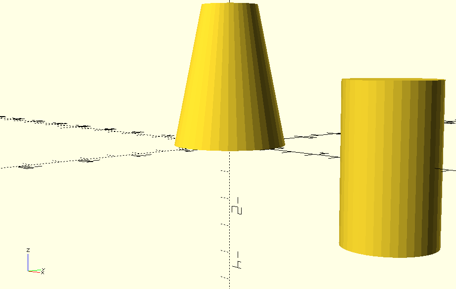{ width=100% }

Aunque ``cylinder`` está pensado para crear cilindros se puede jugar con valores bajos de ``$fn`` y crear prismas. A modo de ejercicio se anima al lector a probar con valores de $fn de 3, 4, y 5

## Operadores: rotación

Permite rotar uno o varios objetos en varios ejes. La rotación se mide en grados:

    //Cubo que mide:
    //10 unidades en el eje X
    //5  unidades en el eje Y
    //20 unidades en el eje Z
    cube([10, 5, 20], center=true);

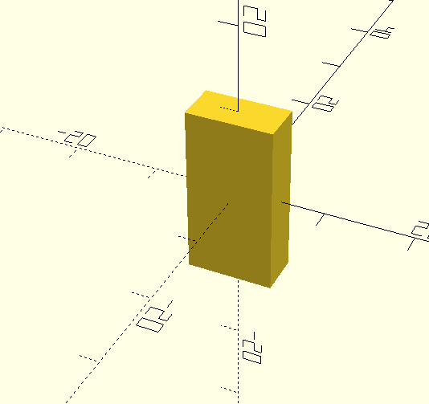{ width=100% }

Si ahora rotamos en el eje de las X:

    //EXACTAMENTE el mismo
    //objeto, pero movido 45 grados
    //usando x como eje de rotación 
    rotate(a=[45, 0,0]) cube([10, 5, 20], center=true);

Obtenemos esto:

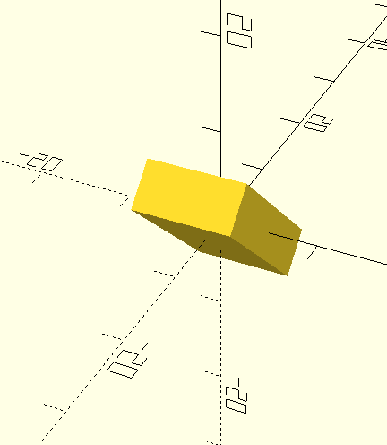{ width=100% }

O rotamos en el eje de las Y:

    //EXACTAMENTE el mismo
    //objeto, pero movido 60 grados
    //usando y como eje de rotación 
    rotate(a=[0, 60,0]) cube([10, 5, 20], center=true);

Lo que produce esto otro:

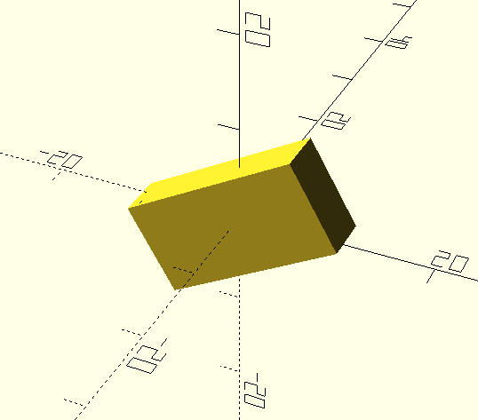{ width=100% }

Para saber en qué sentido se usa la **regla de la mano derecha.** Movemos nuestra mano hasta que el pulgar se alinee con el sentido positivo de un eje y luego observamos el sentido de giro de los dedos (imagen tomada de Wikipedia)

{ width=100% }

Así, por ejemplo, para saber como funciona una rotación sobre el eje X ponemos nuestro pulgar apuntando hacia la derecha y observamos como los dedos indican que el objeto "se inclinará hacia nosotros" al poner una rotación positiva. Si rotamos usando Z, pondremos el pulgar hacia arriba y veremos que entonces el objeto rota "desde nuestra derecha hacia nuestra izquierda".

## Operadores: encadenamiento de operadores y color

Para ver esto, se debe usar la *previsualización* de piezas con F5, no el renderizado completo con F6.

Esto **no influye en nada si imprimimos una pieza** pero puede ser útil. Podemos modificar el color de una pieza usando valores RGB con valores comprendidos entre 0.0 (que indica el mínimo de ese color) hasta 1.0 (que indica el máximo de ese color).

Para el ejemplo siguiente hemos encadenado varios operadores uno detrás de otro, lo que implica poder hacer varias transformaciones a la vez a una pieza determinada:

    //Cubo completamente rojo
    //con una esquina en el centro
    color([1, 0, 0]) 
        cube([10, 10, 10]);

    //Cubo verde ubicado
    //a la derecha
    color([0, 1, 0])
        translate([12, 0, 0])
        cube([10, 10, 10]);
        
    //Cubo azul ubicado
    //aún más a la derecha
    color([0, 0, 1])
        translate([24, 0, 0])
        cube([10, 10, 10]);

Que produce esto:

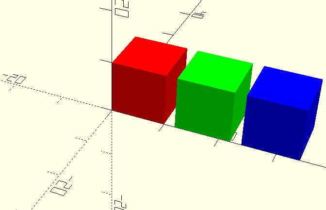{ width=100% }

## Operadores: redimensionado

Se puede deformar un objeto cualquiera usando ``resize`` y ``scale``.

* El operador ``scale`` usa *escalas*, así que si indicamos una escala como ``[2, 1.5, 0.5]`` haremos que un objeto sea *el doble mayor* en X, *un 50% más grande* en Y y un *50% más pequeño* en Z.
* El operador ``resize`` usa *cajas*. Si por ejemplo indicamos que un objeto se redimensione usando ``[30, 40, 10]`` indicaremos que el objeto deme pasar a medir 30 en el eje X, 40 en Y y 10 en Z. Esta operación requiere bastante precisión y puede ser más lenta de renderizar.

Aquí tenemos dos esferas:

    /*Una esfera normal*/
    sphere(r=10);
    //Una esfera tan "achatada"
    //que se ha convertido en disco
    scale ([1, 1, 0.2]) 
        translate([20, 20, 0])
            sphere(r=10);

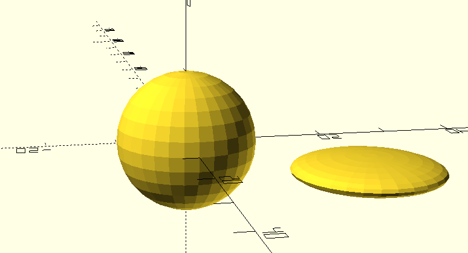{width=100%}

Si hacemos esto con ``resize`` 

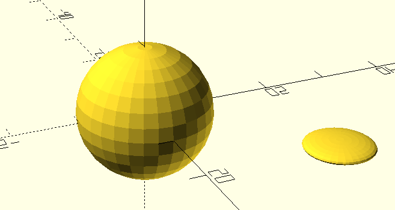{width=100%}

Obsérvese que en este caso, no es lo mismo aplicar primero ``resize`` y luego ``translate`` que hacer ``translate`` y luego ``resize`` 

## Objetos 2D

Las figuras 2D solo se muestran con la previsualización (F5). En el modo renderizado solo se ve su silueta.

Por supuesto, a los objetos 2D se les pueden aplicar las transformaciones que ya conocemos: traslación, escalado, redimensionado y coloreado.

## Objetos 2D: rectángulos

En cuando al código se puede usar esto para crear rectángulos. Recuérdese que un cuadrado es un rectángulo con ambos lados iguales:

    square([10,20],  center=true);

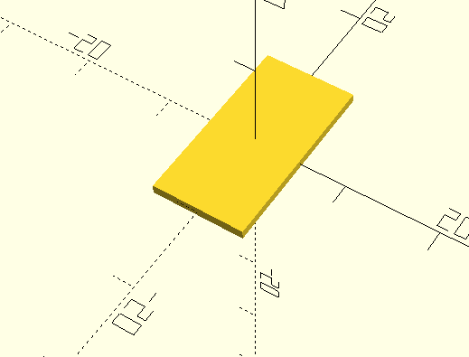{width=100%}

## Objetos 2D: círculos

Esto crea un círculo de radio 10:

    circle(10);

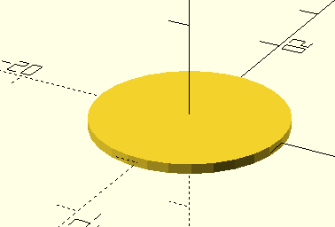{width=100%]

Y simular una elipse usando el reescalado con ``scale`` :

    //Podemos construir 
    //una elipse escalando
    //un círculo
    scale([2, 0.5])
        circle(10);

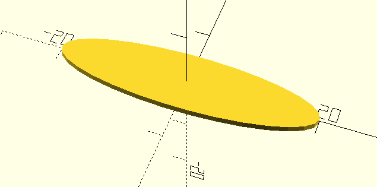{width=100%]

## Objetos 2D: polígonos regulares

Usando ``circle`` se pueden construir polígonos regulares usando ``$fn`` y pasando el número de caras del polígono. Aquí se muestra un pentágono:

    //Pentágono
    circle(10, $fn=5);

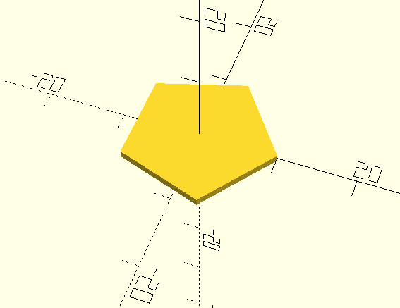{width=100%]

## Objetos 2D: polígonos irregulares

Si indicamos una secuencia de puntos a la función ``polygon`` podremos crear polígonos con cualquier forma:

    polygon([
        [0,0], 
        [7,0],
        [4,8],
        [2,6]
    ]);

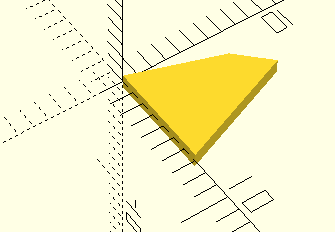{width=100%]}

## Objetos 2d: texto

Para escribir un texto en el modelo podemos usar ``text``::

    //Cubo
    cube([10, 10, 10]);

    //Un texto movido hacia abajo
    //un poco empequeñecido
    //y de color azul
    translate([0, -5, 0])
        scale([0.5, 0.5, 0.5])
            color([0.5, 0.75, 1])
                text("Cubo");

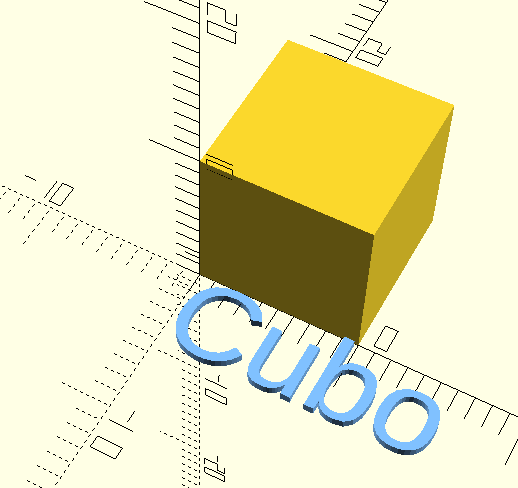{width=100%}

## Operadores: extrusión

Un polígono 2D se puede "prolongar" a lo largo del eje Z y así **construir una figura 3D a partir de un polígono 2D**. A esta operación se le denomina "extruir". Tomemos el polígono anterior y extruyámoslo a lo largo de 20 puntos del eje Z:

    linear_extrude(10)
        polygon([
            [0,0], 
            [7,0],
            [4,8],
            [2,6]
        ]);

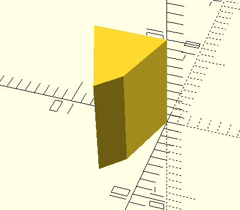{width=100%}

La extrusión acepta un parámetro ``twist`` que permite indicar si el objeto irá girando mientras "se estira"::

    //Pentágono extruido 
    //10 unidades hacia arriba
    //Va girando hacia arriba hasta
    //terminar girado 45 grados
    //respecto al original
    //y con 100 "secciones" en total
    linear_extrude(10, twist=45, slices=100)
        circle(5, $fn=5);
        
        
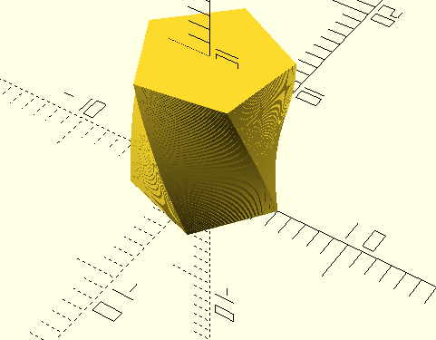{width=100%}

## Operadores: extrusión II, superficies en revolución

Si tomamos un polígono irregular y lo rotamos sobre un cierto eje, podemos hacer "girar" dicha superficie y construir un objeto 3D a partir de uno 2D. Tomemos el polígono irregular que construimos antes y hagámoslo girar con ``rotate_extrude``::

    rotate_extrude($fn=40)
        polygon([
            [0,0], 
            [7,0],
            [4,8],
            [2,6]
        ]);

{width=100%}

## Operadores: diferencia

Es posible tomar un objeto en 3D y "restarle" otro. De esa manera, tendremos la figura primera pero con parte de ella eliminada. Observemos como podemos tener un prisma y una esfera ocupando el mismo espacio:

    //Primer operando: un cubo
    cube([10, 10, 10], center=true);

    //Segundo operando: esfera movida
    //arriba
    translate([0, 0, 5])
        sphere(2.5, $fn=30);

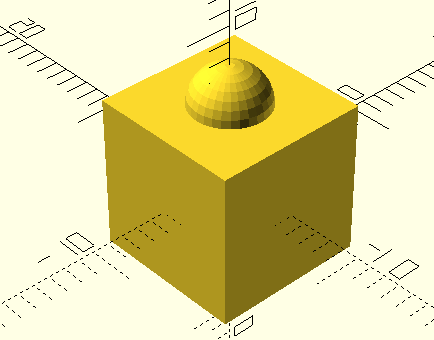

Sin embargo, si hacemos que esto en realidad sea una resta:

    difference()
    {
        //Primer operando: un cubo
        cube([10, 10, 10], center=true);

        //Segundo operando: esfera movida
        //arriba

        translate([0, 0, 5])
            sphere(2.5, $fn=30);
    } //Fin de la diferencia

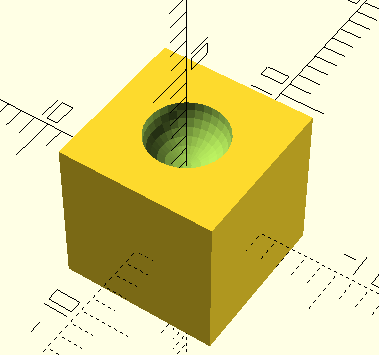