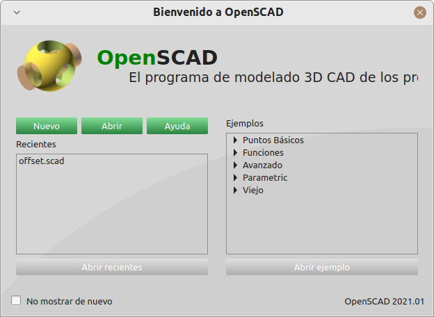
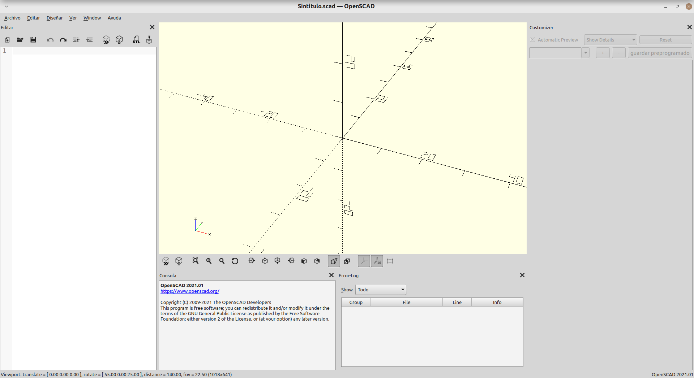
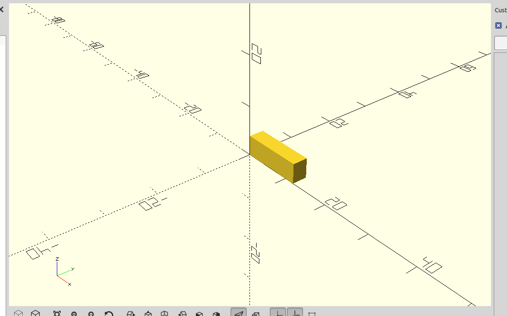

# Tutorial de OpenSCAD

## Introducción

OpenSCAD es un programa CAD (Computer Aided Design o Diseño asistido por ordenador) en 3D. La característica principal es que OpenSCAD *no se maneja usando el ratón* sino por medio de un lenguaje. Esto que a primera vista parece mucho más incómodo se vuelve en realidad mucho más potente cuando queremos construir estructuras repetitivas.

OpenSCAD tiene versiones para los principales sistemas operativos: Windows, Mac y Linux y no necesita instalación: puede descargarse un ZIP, descomprimirlo y simplemente ejecutar el programa

## Primeros pasos

Al ejecutar el programa veremos algo como esto:

Aunque nosotros crearemos un proyecto nuevo vacío pulsando el botón "Nuevo", OpenSCAD ofrece algunos ejemplos creados y que nos permiten ver algunas de las capacidades. Despues de crear un nuevo proyecto, veremos algo como esto:

### Descripción del interfaz

* En la parte izquierda podremos escribir la descripción de nuestros modelos.
* En la parte central, arriba, podremos ver unos ejes de coordenadas:

    * Observa el eje de las X, está en rojo y apunta hacia la derecha: esto significa que en principio, los valores positivos de X crecen en ese sentido.
    * El eje de las Y apunta "hacia el interior de la pantalla", en diagonal.
    * El eje de las Z apunta hacia arriba.
* En la parte central, abajo, veremos un panel llamado "Consola", nos permitirá ver el proceso que sigue OpenSCAD al construir nuestros modelos, incluyendo los errores que cometamos.
* En la parte central, derecha, veremos los errores que cometamos y el punto exacto donde los hemos cometido.
* En la parte derecha, veremos un panel llamado "Customizer" que nos permitirá modificar algunas opciones, en este tutorial *no lo usaremos*

### Un primer modelo

Escribe en la parte izquierda el siguiente código::

    cube ([12, 3, 4])

Pulsa despues F6 y verás esto:

